# RMT-net
## This is our core code, if you want to use them in your work, please follow our instructions to run them
### Datasets
The CT slices andX-rayimages of the COVID-19 patients are collected as the experimental dataset from GitHub, Kaggle, Kesci websites and Wuhan Tongji Hospital (https://github.com/ieee8023/covid-chestxray-dataset, https://www.kaggle.com/paultimothymooney/chest-xray-pneumonia, https://www.kesci.com/mw/dataset/5e746ec998d4a8002d2b0861).

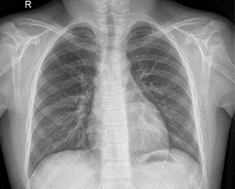

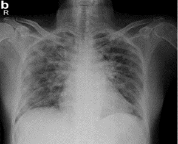

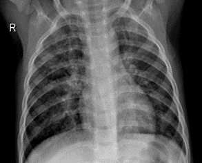

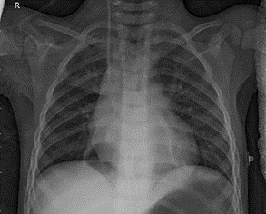

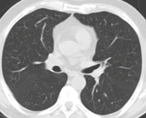

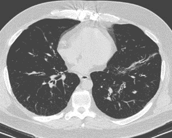
### Overal Architecture
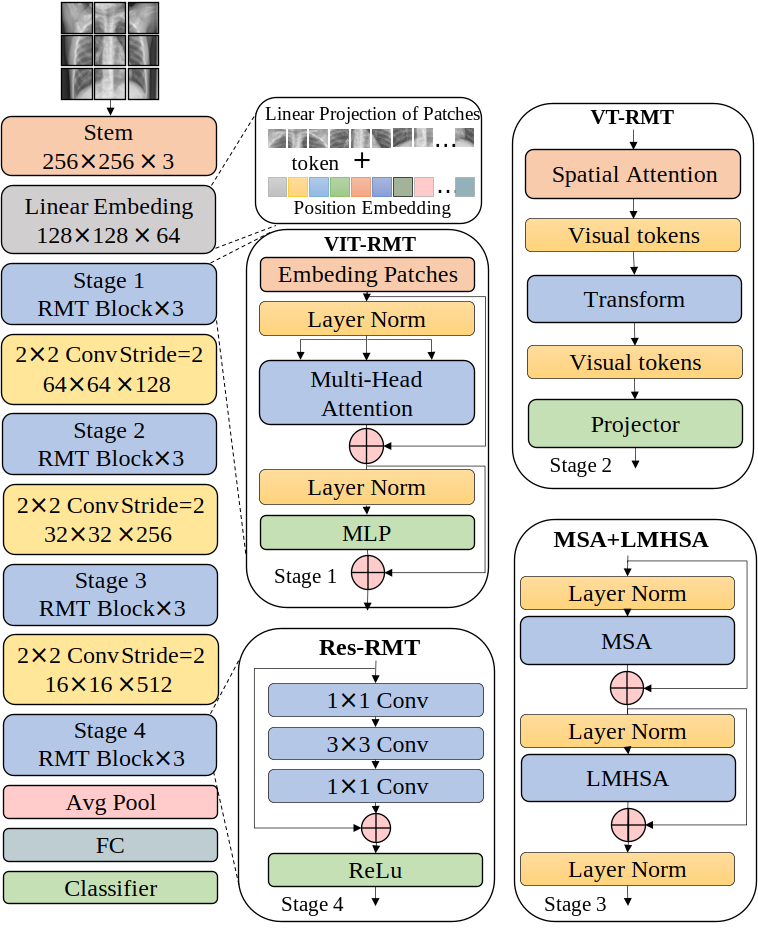

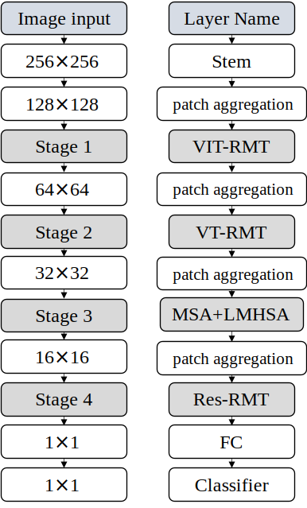

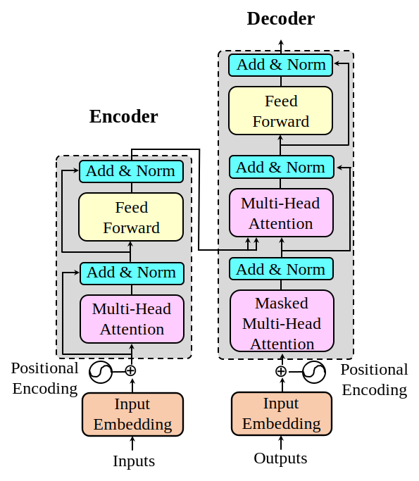

## Environment Preparing
Requirements

The main requirements are listed below:
```
Training with Pytorch 1.9

Python 3.6

Numpy

Scikit-Learn

Matplotlib

Additional requirements to generate dataset:

Pandas

Jupyter
...

```


### Result

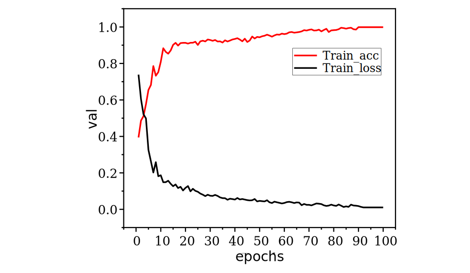

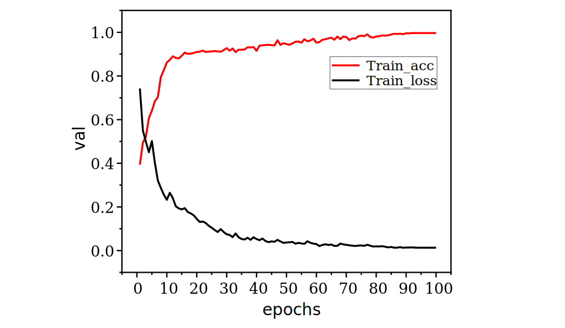

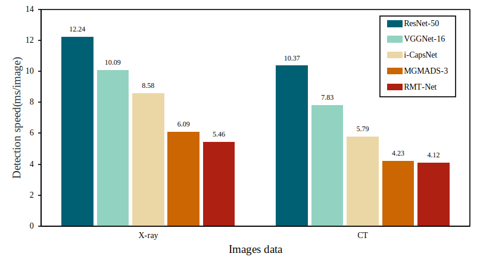

